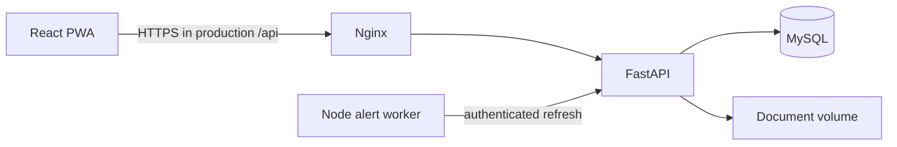

# MOne CoalChain Architecture

## Runtime

The application uses a React PWA client, FastAPI business API, MySQL 8.4, and a small Node.js alert worker. Docker Compose keeps the database and worker private; only the Nginx web gateway is exposed on `127.0.0.1:8080`.

## Transaction control

`DRAFT → SUBMITTED → approval stages → VERIFIED/APPROVED → CLOSED` is retained with its approval workflow and version. Final rows cannot be edited. A controlled reopen requires Mine Manager or Administrator approval and is blocked once a downstream record uses the transaction.

The API is the only calculation authority. The client submits inputs and renders returned values; it cannot set commercial quantity, contract rate, claim gross/net, retention, penalty, or incentive.

## Security design

- Session cookies are `HttpOnly`, `SameSite=Strict`, random, and expire after 30 minutes idle time.
- Every mutation requires `X-MCMS-Request: 1`, forcing a same-origin browser preflight; the API does not grant cross-origin CORS access.
- Passwords use `scrypt` with a unique salt. Initial secrets are environment variables only.
- Role, site, and contractor scopes are evaluated server-side on each read and write. Contractor roles see their own contractor data plus scoped location masters.
- Optimistic versions prevent lost updates. Natural keys and server validation block duplicate DPR, fuel references, rate overlaps, scorecards, and invoices.
- Audit log captures create/update/action, actor, timestamp, reason, and before/after values. Attachments are authorized through their parent transaction.

## Integration boundary

The REST API is documented at `/api/docs`. ERP, weighbridge, fleet GPS, fuel station, laboratory, HR, and procurement connectors are intentionally not preconfigured because their authentication, field mapping, retry policy, and reconciliation ownership are company-specific. The worker currently refreshes alert state; it does not call third-party systems.

## Operations

Use Docker MySQL in production. SQLite exists only for local development through `scripts/start-local.ps1`. Put Nginx behind a TLS reverse proxy, set `MCMS_SECURE_COOKIE=true`, persist encrypted backups, provide SMTP/API credentials through a managed secret store, and establish monitoring before production use.
